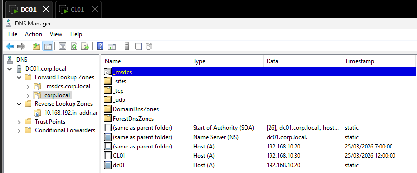
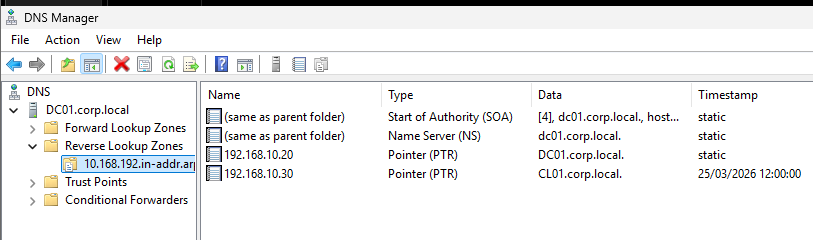
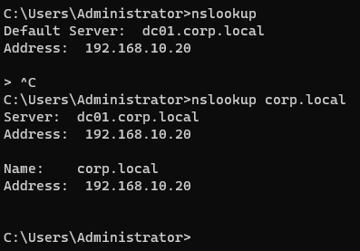

# DNS in Active Directory

## Objective
Configure and validate DNS within Active Directory to ensure proper name resolution for domain services.

## What I configured
- Verified that DNS was installed during Domain Controller promotion
- Created and validated the forward lookup zone for `corp.local`
- Created and configured a reverse lookup zone for the network `192.168.10.0/24`
- Ensured the Domain Controller registers its records automatically
- Tested DNS resolution using `nslookup`

## Validation
- Verified that `corp.local` resolves to the Domain Controller IP
- Verified that `DC01` resolves correctly within the domain
- Confirmed reverse lookup functionality

## Result
DNS is fully operational and correctly integrated with Active Directory. Clients can resolve domain names and locate the Domain Controller successfully.

## Troubleshooting
During the DNS setup and validation phase, I encountered inconsistent name resolution while testing the Domain Controller.

### Issue
Initial DNS lookups were inconsistent and some tests returned incomplete or misleading results during validation.

### Root Cause
The issue was related to incomplete DNS validation and the need to properly configure and verify both forward and reverse lookup zones in Active Directory DNS.

### Solution
- Verified that the Domain Controller was using its own static IP address as DNS server
- Created and validated the reverse lookup zone for `192.168.10.0/24`
- Re-tested name resolution using `nslookup`
- Confirmed that both forward and reverse DNS resolution were working correctly

### Lesson Learned
Active Directory depends heavily on correct DNS configuration. Forward lookup alone is not enough for a clean and reliable domain environment.

## Screenshots

### Forward Lookup Zone

### Reverse Lookup Zone

### DNS Resolution Test

