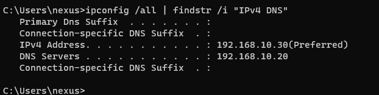
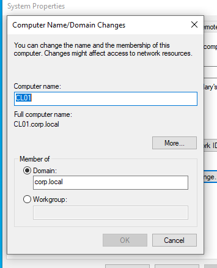
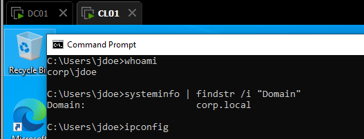

# Domain Join

## Objective
Join a Windows client machine to the Active Directory domain and verify authentication.

## What I configured
- Set a static IP address on the client
- Configured DNS to point to the Domain Controller (192.168.10.20)
- Renamed the client machine
- Joined the client to the `corp.local` domain

## Validation
- Verified domain membership on the client
- Successfully logged in using a domain user account (`CORP\jdoe`)
- Confirmed authentication using command line tools

## Result
The client machine successfully joined the domain and can authenticate users through Active Directory.

## Troubleshooting

During the domain join process, I encountered issues where the client could not properly authenticate with the Domain Controller.

### Issue
- The client was unable to join the domain correctly
- No credential prompt appeared during the join process
- Authentication attempts failed

### Root Cause
The issue was caused by an inconsistent client state due to multiple incorrect domain join attempts and misconfiguration between workgroup and domain.

### Solution
- Reset the client to a clean workgroup state
- Reconfigured network settings (DNS pointing to the Domain Controller)
- Ensured proper domain join procedure
- Retried the domain join process

### Result
The client successfully joined the domain and authentication worked correctly.

## Screenshots

### Client Network Configuration

### Domain Join Confirmation

### Domain Login Success

