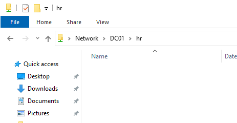
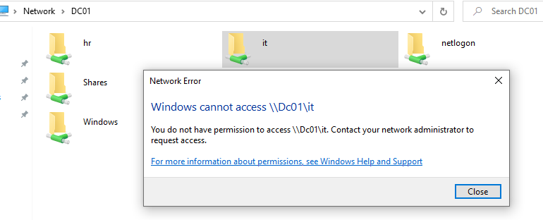
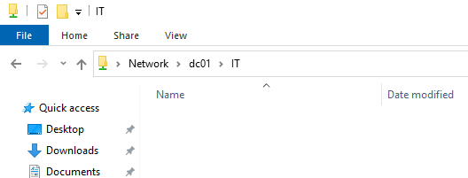

# File Share Permissions – RBAC Implementation

## Objective

Configure secure file sharing using NTFS permissions and Role-Based Access Control (RBAC) in Active Directory.

## Environment

* Domain: corp.local
* Domain Controller: DC01
* Client: CL01

## Configuration

### 1. Folder Structure

Created structured directories:

C:\Shares\HR
C:\Shares\IT

---

### 2. Security Groups

Created groups:

* HR-Users
* IT-Admins

Assigned users:

* jdoe → HR-Users
* admin.user → IT-Admins

---

### 3. NTFS Permissions

Inheritance was disabled and replaced with explicit permissions.

#### HR Folder

* HR-Users → Modify
* Administrators → Full Control
* SYSTEM → Full Control

#### IT Folder

* IT-Admins → Full Control
* Administrators → Full Control
* SYSTEM → Full Control

---

### 4. Share Configuration

Folders were shared:

* \DC01\HR
* \DC01\IT

Share permissions aligned with security groups.

---

## Validation

### HR User Test (jdoe)

* Access to \DC01\HR → Success
* Access to \DC01\IT → Access Denied

### IT Admin Test (admin.user)

* Access to \DC01\IT → Success

---

## Result

Access was correctly enforced based on group membership.

---

## Key Takeaways

* Use groups instead of assigning permissions directly to users
* Combine NTFS and Share permissions
* Disable inheritance for full control
* Validate access with real user testing

---

## Screenshots

### HR Access Success

### IT Access Denied

### IT Access Success

