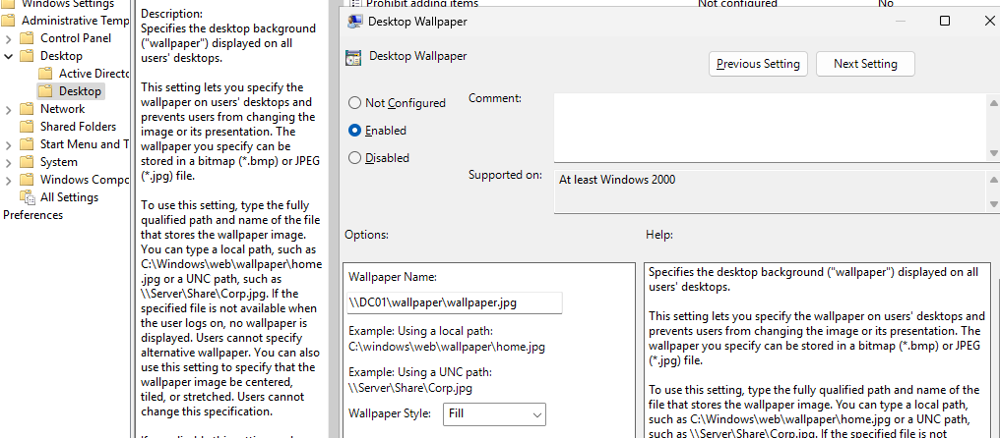
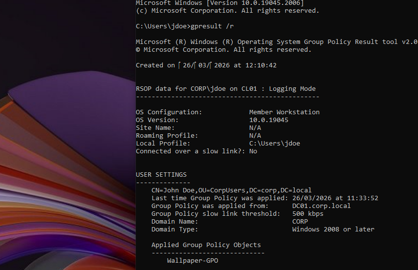
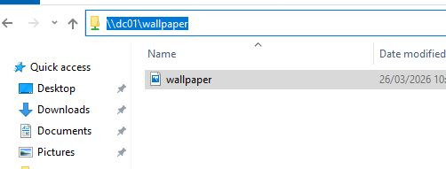

# Group Policy – Desktop Wallpaper

## Objective

Configure and apply a Group Policy Object (GPO) to enforce a desktop wallpaper for domain users.

## Environment

* Domain: corp.local
* Domain Controller: DC01
* Client: CL01
* User: CORP\jdoe

## Configuration

### 1. File Share

A shared folder was created on the Domain Controller:

C:\wallpaper

Shared as:

\DC01\wallpaper

Permissions:

* Share: Everyone (Read)
* NTFS: Read access

---

### 2. GPO Configuration

A GPO named:

Corp Wallpaper Policy

Was linked to:

CorpUsers OU

Configured under:

User Configuration → Administrative Templates → Desktop → Desktop Wallpaper

Settings:

* Enabled
* Path: \DC01\wallpaper\wallpaper.bmp
* Style: Center

---

### 3. Apply Policy

On the client:

gpupdate /force

User logged in as:

CORP\jdoe

---

## Issue Encountered

The wallpaper GPO did not apply correctly during initial testing.

## Symptoms

* Wallpaper remained black or unchanged
* GPO appeared correctly configured
* Shared file was accessible
* User was in the correct OU

## Root Cause

The issue was caused by a registry-related problem on the client, which prevented the wallpaper policy from applying correctly.

## Resolution

* Verified GPO scope and OU placement
* Verified access to the shared wallpaper file
* Corrected the registry issue
* Forced Group Policy update
* Re-logged into the domain user

## Result

The desktop wallpaper was successfully applied through Group Policy.

---

## Screenshots

### GPO Configuration

### Wallpaper Applied

### Share Access Validation

