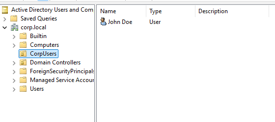

# Users and Groups

## Objective
Create and manage user accounts within Active Directory.

## What I configured
- Created an Organizational Unit (OU) to organize users
- Created a domain user account (`jdoe`)
- Assigned a secure password
- Verified that the user can authenticate within the domain

## Validation
- Successfully logged in with the domain user `CORP\jdoe`
- Confirmed authentication against the Domain Controller

## Result
User account management is functional within the domain, and authentication works correctly.

## Screenshots

### User Creation

### Domain Login

