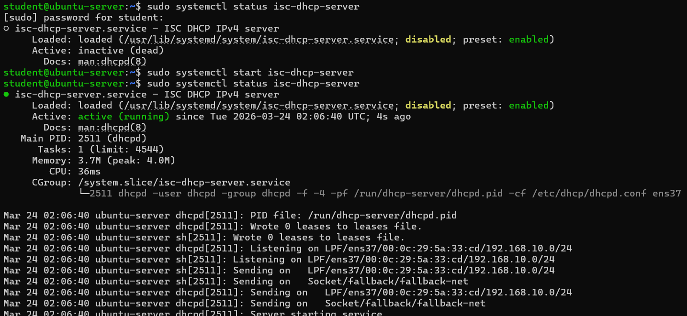
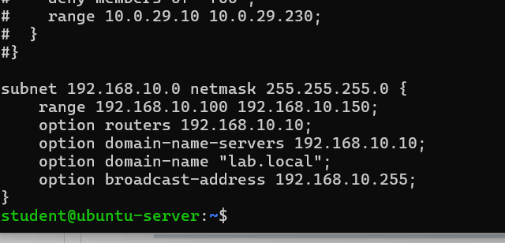
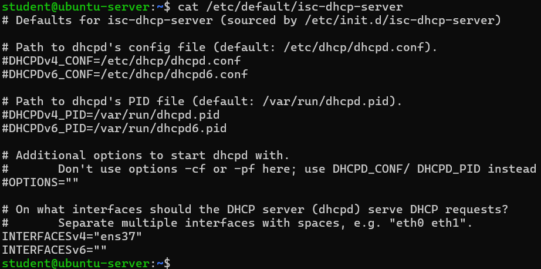
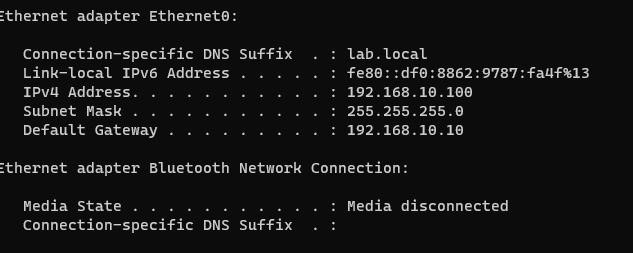

# Linux DHCP Lab

## Objective

The goal of this lab is to configure a DHCP server on Ubuntu to automatically assign IP addresses to clients.

---

## Environment

* Ubuntu Server
* ISC DHCP Server
* VMware (Host-only network VMnet1)

---

## Network Configuration

The lab network was configured using a host-only adapter:

* Server IP: **192.168.10.10**
* Subnet: **192.168.10.0/24**

---

## Goal

Automatically assign IP addresses to clients within the following range:

**192.168.10.100 – 192.168.10.150**

---

## DHCP Configuration

### Install DHCP Server

```bash
sudo apt install isc-dhcp-server -y
```

---

### Configure DHCP Scope

```bash
sudo nano /etc/dhcp/dhcpd.conf
```

```conf
subnet 192.168.10.0 netmask 255.255.255.0 {
    range 192.168.10.100 192.168.10.150;
    option routers 192.168.10.10;
    option domain-name-servers 192.168.10.10;
    option domain-name "lab.local";
    option broadcast-address 192.168.10.255;
}
```

---

### Configure Interface

```bash
sudo nano /etc/default/isc-dhcp-server
```

```text
INTERFACESv4="ens37"
```

---

### Start DHCP Server

```bash
sudo systemctl restart isc-dhcp-server
sudo systemctl status isc-dhcp-server
```

---

## Testing

A client machine connected to the same VMnet1 network received an IP address automatically:

```bash
ip a
```

The assigned IP was within the configured range:

```text
192.168.10.100 – 192.168.10.150
```

---

## Troubleshooting

### DHCP Conflict Issue

During initial testing, DHCP did not work correctly when using bridged networking.

This was caused by another DHCP server (router) responding faster than the Ubuntu server.

### Solution

* Switched to a host-only network (VMnet1)
* Disabled VMware DHCP for VMnet1
* Assigned a static IP to the server

---

## Result

A fully functional DHCP server capable of automatically assigning IP addresses within the lab network.

---

## What I Learned

* How DHCP works in a network
* Configuring DHCP scopes and options
* Interface binding for DHCP services
* Troubleshooting DHCP conflicts
* Importance of isolated lab networks

---

## Screenshots









