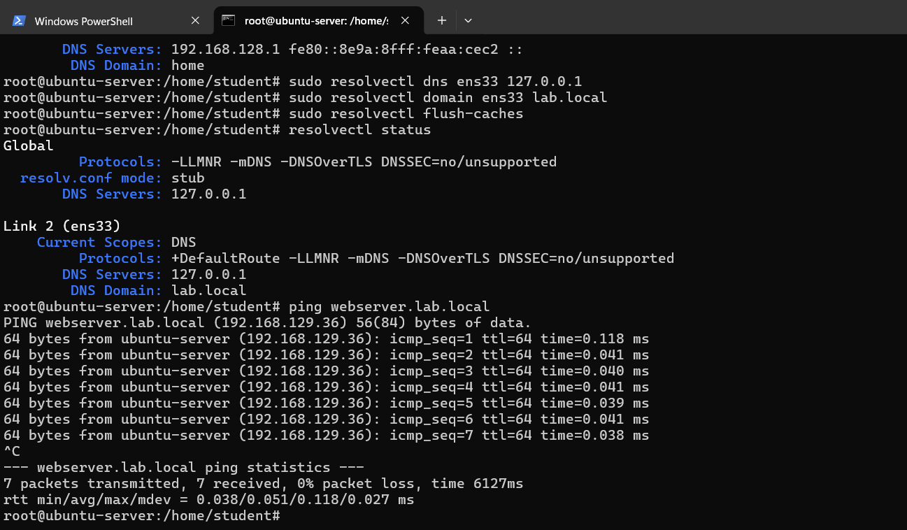
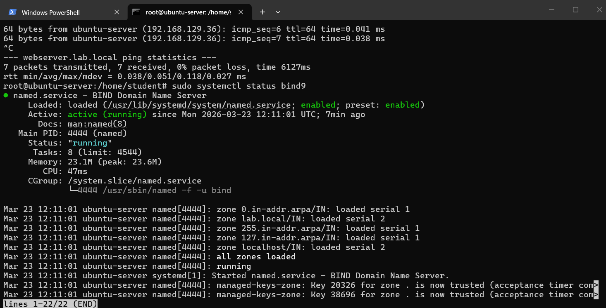
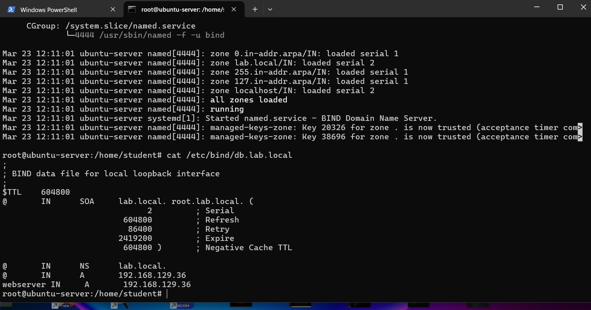

# Linux DNS Lab

## Objective

The goal of this lab is to configure a local DNS server using BIND9 and resolve domain names to IP addresses within a local network.

## Environment

* Ubuntu Server
* BIND9 DNS Server
* Local network (VMware)

## Goal

Resolve a custom domain name like:

webserver.local → 192.168.129.36

## DNS Configuration

I configured a local DNS server using BIND9 to resolve custom domain names.

### Domain

webserver.lab.local → 192.168.129.36

### Commands used

```bash
sudo apt install bind9 -y
sudo nano /etc/bind/named.conf.local
sudo nano /etc/bind/db.lab.local
sudo systemctl restart bind9
```

### Configure system resolver

```bash
sudo resolvectl dns ens33 127.0.0.1
sudo resolvectl domain ens33 lab.local
```

### Test

```bash
ping webserver.lab.local
```

### Screenshots







