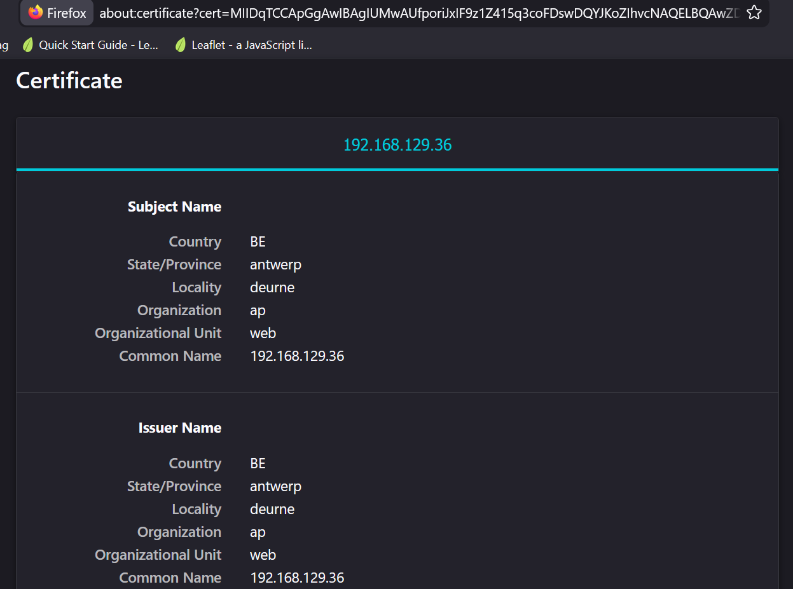

# Linux Web Server Lab

## Objective

The goal of this lab is to install and configure Nginx on Ubuntu Server and verify web access from a client machine.

---

## Environment

* VMware Workstation
* Ubuntu Server 24.04 LTS
* SSH access

---

## Network Configuration

The server is running on a host-only lab network with the following IP address:

**192.168.10.10**

---

## Steps

### 1. Update Package List

```bash
sudo apt update
```

---

### 2. Install Nginx

```bash
sudo apt install nginx -y
```

---

### 3. Verify Nginx Service

```bash
sudo systemctl status nginx
```

---

### 4. Test Web Access

Open a browser on the host machine:

```
http://192.168.10.10
```

---

## Result

The default Nginx welcome page is accessible from the client machine.

---

## Custom Website

The default Nginx page was replaced with a custom HTML page.

### Commands Used

```bash
sudo cp /var/www/html/index.nginx-debian.html /var/www/html/index.nginx-debian.html.bak
sudo nano /var/www/html/index.html
sudo rm /var/www/html/index.nginx-debian.html
sudo systemctl reload nginx
```

---

## Firewall Configuration (UFW)

To secure the server, UFW was configured.

### Commands Used

```bash
sudo apt install ufw -y
sudo ufw allow ssh
sudo ufw allow 80
sudo ufw enable
sudo ufw status
```

---

## Multiple Websites (Virtual Hosts)

A second website was configured using a different port.

### Setup

```bash
sudo mkdir -p /var/www/site2
sudo nano /var/www/site2/index.html
sudo chown -R www-data:www-data /var/www/site2
```

### Nginx Configuration

```bash
sudo nano /etc/nginx/sites-available/site2
sudo ln -s /etc/nginx/sites-available/site2 /etc/nginx/sites-enabled/
sudo nginx -t
sudo systemctl reload nginx
```

### Firewall

```bash
sudo ufw allow 8080
```

---

## HTTPS Configuration (Self-Signed SSL)

A self-signed certificate was created to enable HTTPS.

### Commands Used

```bash
sudo apt install openssl -y
sudo openssl req -x509 -nodes -days 365 -newkey rsa:2048 \
-keyout /etc/ssl/private/nginx-selfsigned.key \
-out /etc/ssl/certs/nginx-selfsigned.crt
```

### Nginx Configuration

```bash
sudo nano /etc/nginx/sites-available/default
sudo nginx -t
sudo systemctl reload nginx
```

### Firewall

```bash
sudo ufw allow 443
```

---

### Note

The HTTPS setup uses a self-signed SSL certificate.
Because it is not issued by a trusted Certificate Authority, browsers display a warning even though the connection is encrypted.

---

## Real SSL Attempt (Let's Encrypt)

A test was performed to configure a publicly trusted SSL certificate.

### Result

This was not possible because the server is running on a private IP address:

**192.168.10.10**

Let's Encrypt requires:

* A publicly accessible domain
* Or DNS-based validation

---

## What I Learned

* Installing and configuring Nginx
* Hosting a custom website
* Configuring firewall rules (UFW)
* Hosting multiple sites on one server
* Understanding HTTPS and SSL certificates
* Difference between self-signed and trusted certificates

---

## Screenshots




