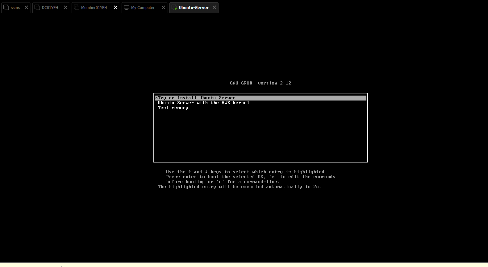
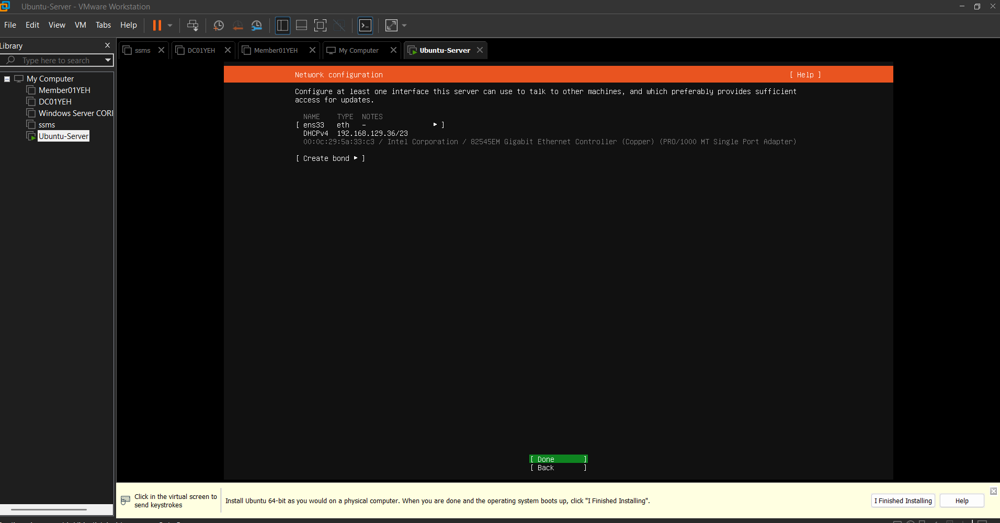
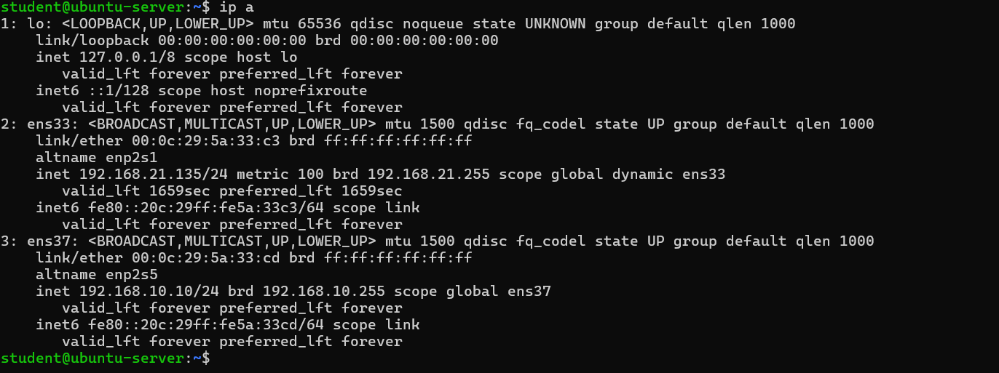
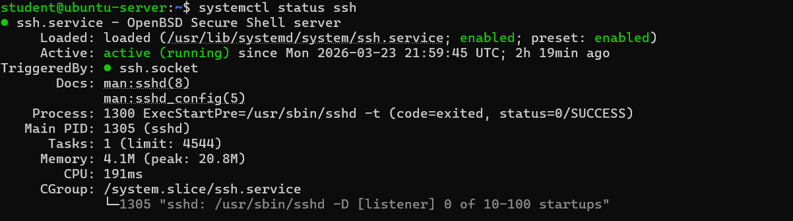
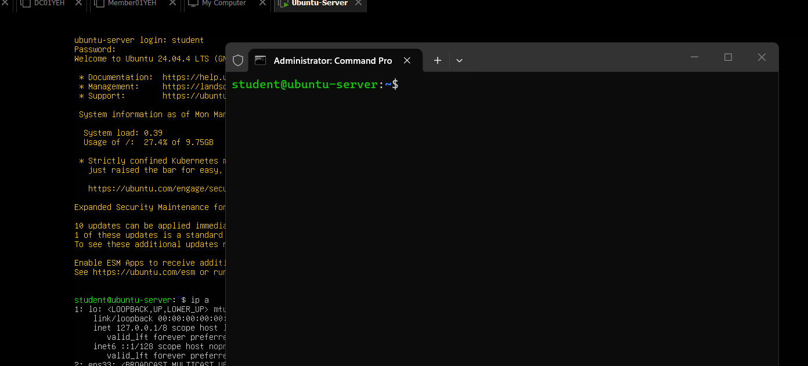

# Linux Server Lab

## Objective

The goal of this lab was to install and configure an Ubuntu Server and enable remote access using SSH.

---

## Environment

* VMware Workstation
* Ubuntu Server 24.04 LTS


---

# 🧠 EXTRA CLEANUP (aanrader)

Maak je note netjes bovenaan:

```markdown
> **Note**
>
> During installation, the server initially received an IP address via DHCP on a bridged network.  
> Later, the network configuration was changed to a NAT + Host-only setup for lab isolation and c


## Network Configuration

The server was configured with two network adapters:

* Adapter 1: NAT (internet access)
* Adapter 2: Host-only (VMnet1 lab network)

The server was assigned a static IP address on the lab network:

```bash
192.168.10.10
```

---

## Steps

### 1. Virtual Machine Setup

* 4GB RAM
* 20GB disk

---

### 2. Ubuntu Server Installation

The Ubuntu Server operating system was installed using the official ISO.

---

### 3. SSH Configuration

During the installation, the option **"Install OpenSSH server"** was selected, which automatically installed SSH.

After installation, the SSH service was verified:

```bash
sudo systemctl status ssh
```

If the service is not running:

```bash
sudo systemctl start ssh
sudo systemctl enable ssh
```

---

### 4. IP Address Configuration

To verify the network configuration:

```bash
ip a
```

The server uses a static IP on the host-only network:

```bash
192.168.10.10
```

---

### 5. SSH Connection Test

A successful remote connection was established from the host machine:

```bash
ssh student@192.168.10.10
```

---

## Result

A fully functional Linux server with remote SSH access over a dedicated lab network.

---

## What I Learned

* Installing a Linux server
* Configuring SSH access
* Understanding network adapters (NAT vs Host-only)
* Working with static IP addressing
* Troubleshooting connectivity issues

---

## Troubleshooting

### Password Reset Issue

During setup, I encountered an issue where I could not log in due to an incorrect password.

To resolve this:

* Booted into GRUB menu
* Selected **Advanced options for Ubuntu**
* Chose **Recovery mode**
* Opened a root shell

Remounted the filesystem:

```bash
mount -o remount,rw /
```

Reset the password:

```bash
passwd student
```

Rebooted the system:

```bash
reboot
```

---

### Network Connectivity Issue

After changing the network configuration, SSH stopped working due to incorrect adapter mapping.

This was resolved by:

* Configuring Adapter 1 as NAT
* Configuring Adapter 2 as Host-only (VMnet1)
* Assigning a static IP address to the server
* Ensuring the correct interface mapping in Netplan

---

## Lessons Learned

* How to use recovery mode in Linux
* How to remount the filesystem
* How to reset a user password
* Importance of correct keyboard layout (AZERTY vs QWERTY)
* Understanding VMware networking (NAT vs Host-only)

---

## Screenshots

See the `screenshots` folder for installation, SSH, and network configuration images.


## Screenshots







