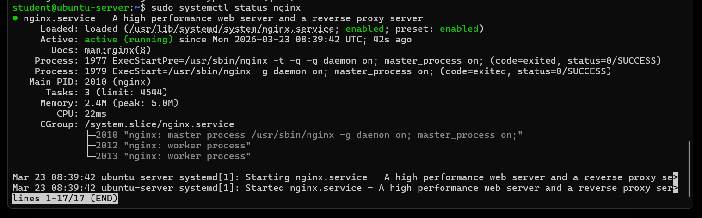
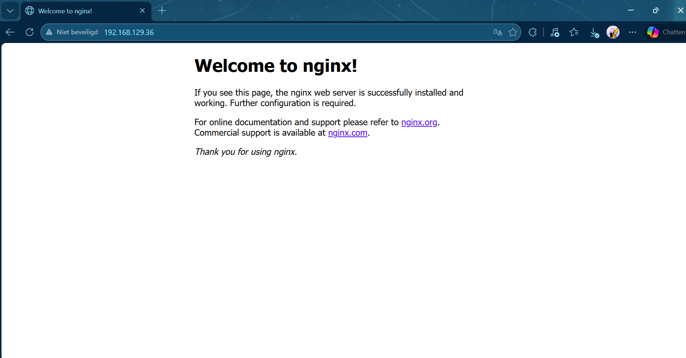
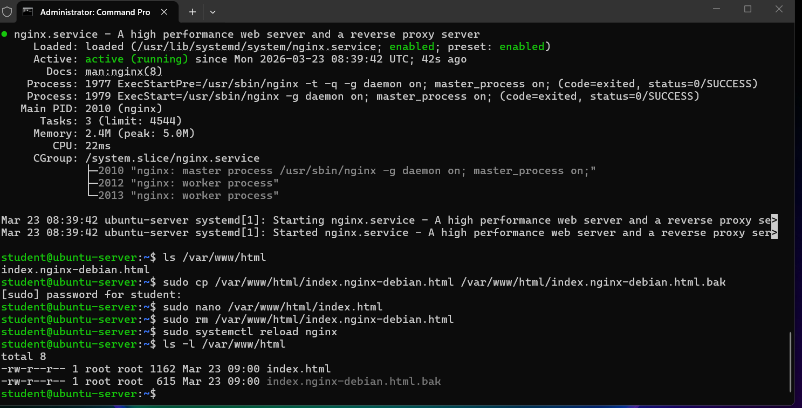
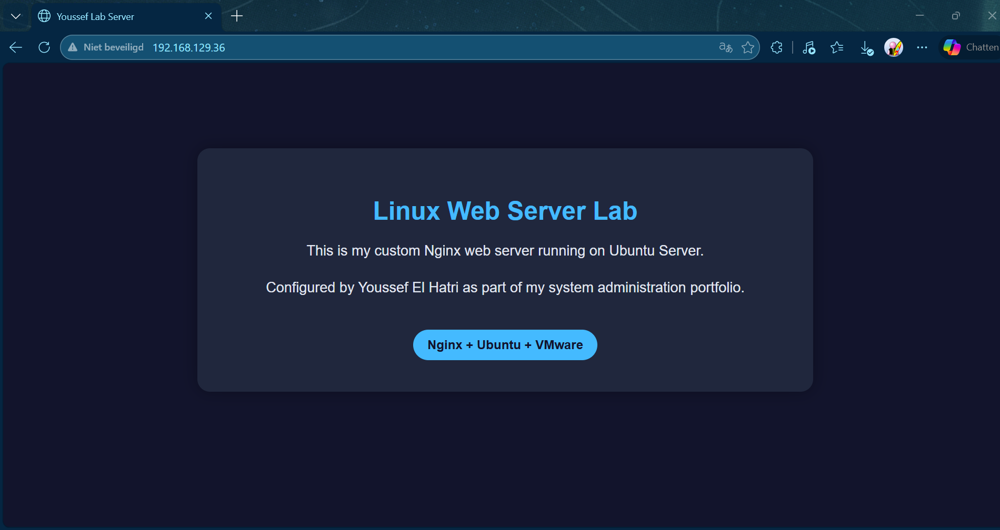
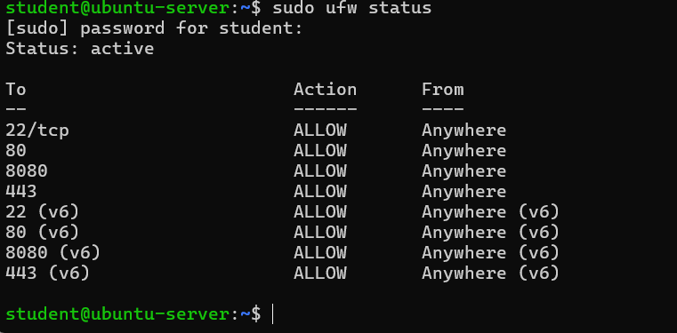
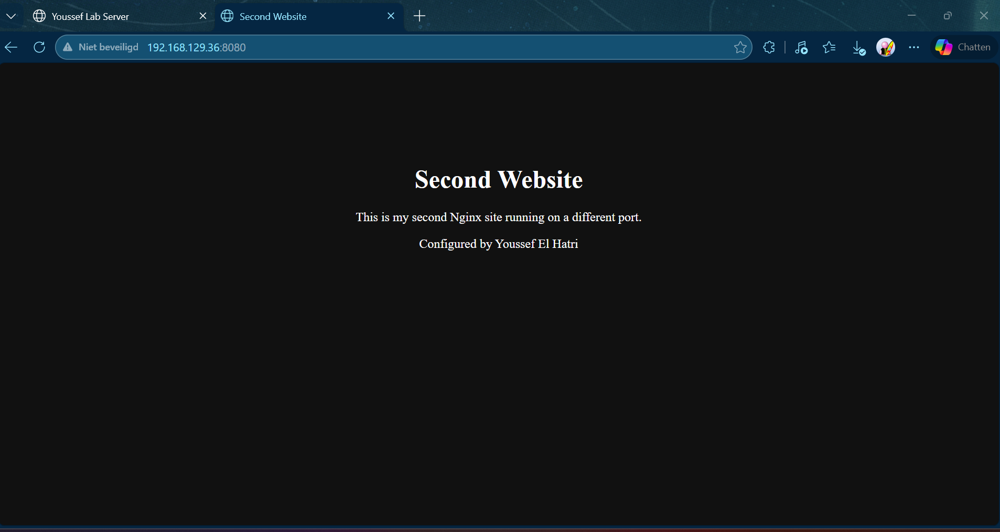

# Linux Web Server Lab

## Objective
The goal of this lab is to install and configure Nginx on Ubuntu Server and verify web access from a client machine.

## Environment
- VMware Workstation
- Ubuntu Server 24.04 LTS
- SSH access already configured

## Steps

### 1. Update package list
```bash
sudo apt update
```

### 2. Install Nginx
```bash
sudo apt install nginx -y
```

### 3. Verify Nginx service
```bash
sudo systemctl status nginx
```

### 4. Test web access
Open a browser on the host machine and browse to:

```bash
http://SERVER-IP
```

## Expected Result
The default Nginx welcome page should be visible from the client machine.

## What I Learned
- How to install Nginx on Ubuntu Server
- How to verify and manage Linux services
- Basic web server deployment
- Testing network connectivity from a client

  ## Screenshots




## Custom Website

After installing Nginx, I replaced the default page with a custom HTML page hosted from `/var/www/html`.

### Commands used

```bash
sudo cp /var/www/html/index.nginx-debian.html /var/www/html/index.nginx-debian.html.bak
sudo nano /var/www/html/index.html
sudo rm /var/www/html/index.nginx-debian.html
sudo systemctl reload nginx
```

## Additional Screenshots

### Web Root Files


### Custom Website


## Firewall Configuration (UFW)

To secure the server, I configured UFW (Uncomplicated Firewall).

### Commands used

```bash
sudo apt install ufw -y
sudo ufw allow ssh
sudo ufw allow 80
sudo ufw enable
sudo ufw status
```

### Screenshot



## Multiple Websites (Virtual Hosts)

I configured Nginx to host multiple websites on the same server using different ports.

### Second Website Setup

```bash
sudo mkdir -p /var/www/site2
sudo nano /var/www/site2/index.html
sudo chown -R www-data:www-data /var/www/site2
```

### Nginx Configuration

```bash
sudo nano /etc/nginx/sites-available/site2
sudo ln -s /etc/nginx/sites-available/site2 /etc/nginx/sites-enabled/
sudo nginx -t
sudo systemctl reload nginx
```

### Firewall

```bash
sudo ufw allow 8080
```

### Screenshots


