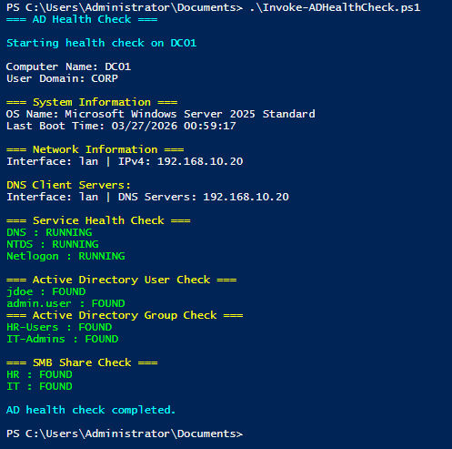

# PowerShell AD Health Check

## Overview
This project demonstrates how to use PowerShell to perform a basic health check on a Windows Server / Active Directory environment.

The script is designed to run on a Domain Controller and validate key components such as system information, network configuration, services, Active Directory objects, and file shares.

## Scope
This is a practical lab built on an existing Active Directory environment.  
It does not deploy infrastructure, but focuses on validation and operational checks.

## Features
- Retrieve system information (hostname, OS, last boot time)
- Display IPv4 network configuration
- Validate DNS client settings
- Check critical services (DNS, NTDS, Netlogon)
- Verify Active Directory users and groups
- Validate SMB shares

## Technologies Used
- PowerShell 5.1
- Active Directory Module
- Windows Server

## How to Run
```powershell
.\Invoke-ADHealthCheck.ps1
```

## Example Output


