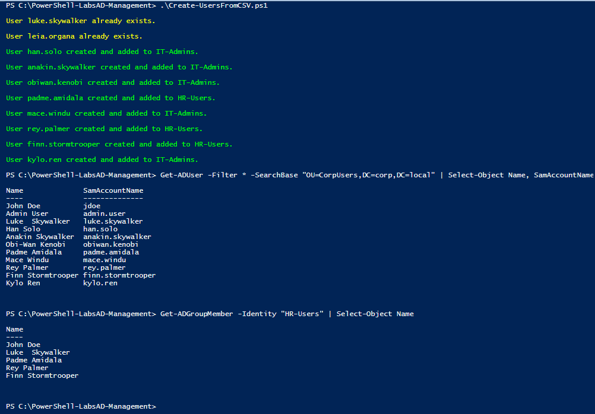

# PowerShell AD Management Lab

## Overview

This project demonstrates how to use PowerShell to automate Active Directory user provisioning in a Windows Server environment.

The lab includes both interactive and bulk user creation approaches, simulating real-world sysadmin tasks.

## Scope

This lab focuses on practical user management tasks in an existing Active Directory environment.

## Features

* Interactive user creation
* Bulk user creation using CSV
* Secure password handling
* Duplicate user validation
* User creation in the `CorpUsers` OU
* Group validation before assignment
* Automatic group membership assignment

## Scripts

### Create-ADUser.ps1

This script allows interactive creation of a single Active Directory user.

Features:

* Prompts for user input (name, username, group)
* Secure password input
* Duplicate user check
* Adds user to specified group

---

### Create-UsersFromCSV.ps1

This script allows bulk creation of multiple users from a CSV file.

Features:

* Reads user data from CSV
* Creates multiple users automatically
* Assigns users to groups
* Validates group existence
* Displays status output for each user

---

## How to Run

### Interactive user creation

```powershell
.\Create-ADUser.ps1
```

### Bulk user creation (CSV)

```powershell
.\Create-UsersFromCSV.ps1
```

## CSV Input

The bulk script uses a CSV file to import multiple users.

Example structure:

```csv
FirstName,LastName,Username,GroupName
John,Doe,john.doe,HR-Users
Jane,Smith,jane.smith,IT-Admins
```

## Screenshots

### Interactive User Creation


### Bulk User Creation and Verification



