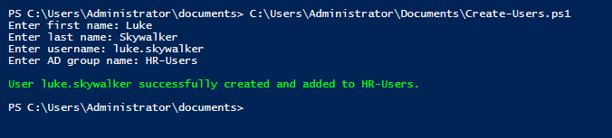

# PowerShell AD Management Lab

## Overview
This project demonstrates how to use PowerShell to automate Active Directory user provisioning in a Windows Server environment.

The script is designed to create new AD users interactively, place them in the correct organizational unit, and add them to the appropriate security group.

## Scope
This lab focuses on practical user management tasks in an existing Active Directory environment.

## Features
- Interactive user input
- Secure password prompt
- Duplicate user check
- User creation in the `CorpUsers` OU
- Group validation before assignment
- Group membership assignment

## Script
- `Create-ADUser.ps1`

## How to Run
Run the script in PowerShell on a Domain Controller or on a management system with the Active Directory module installed:

```powershell
.\Create-ADUser.ps1
```

## Notes
The account is created with a temporary password.  
The user is required to change the password at first logon.


## Screenshot



